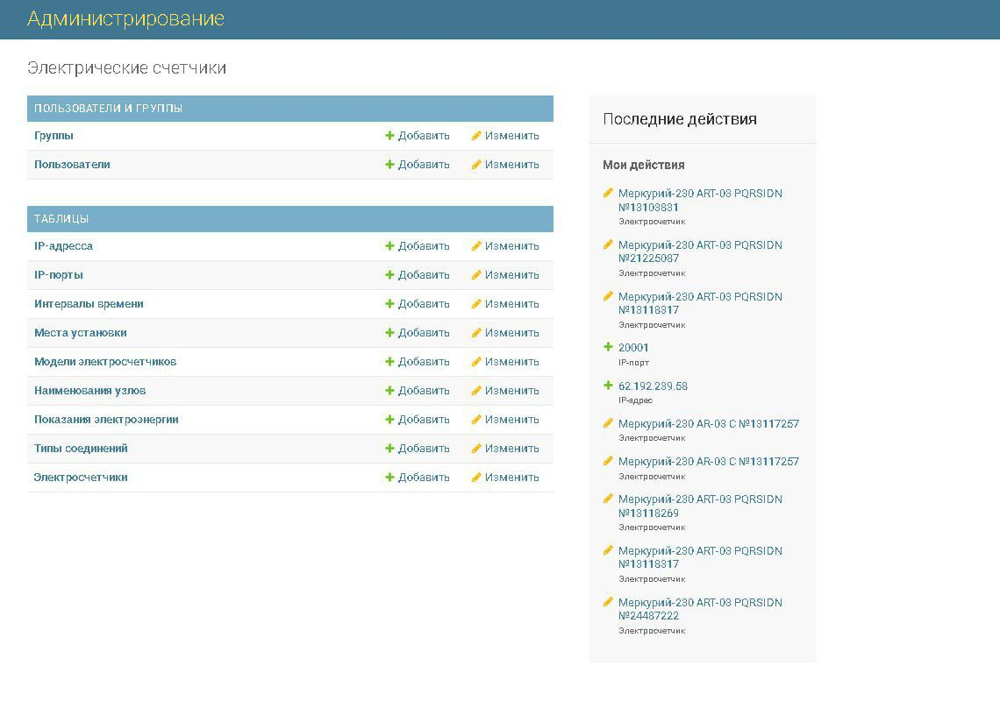
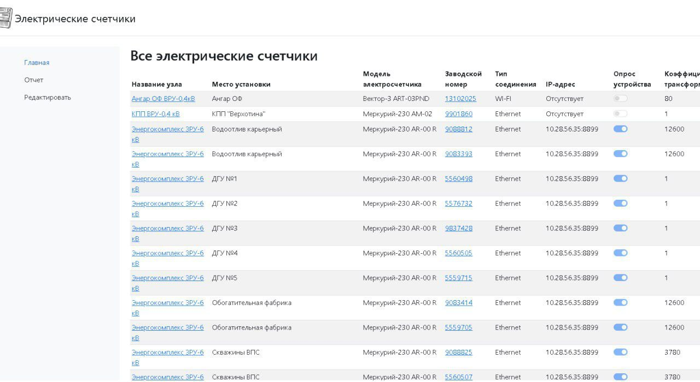
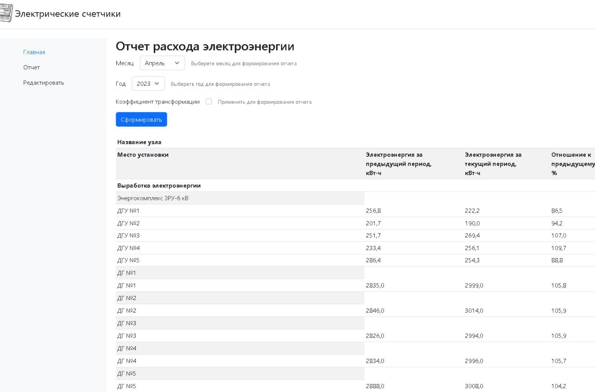
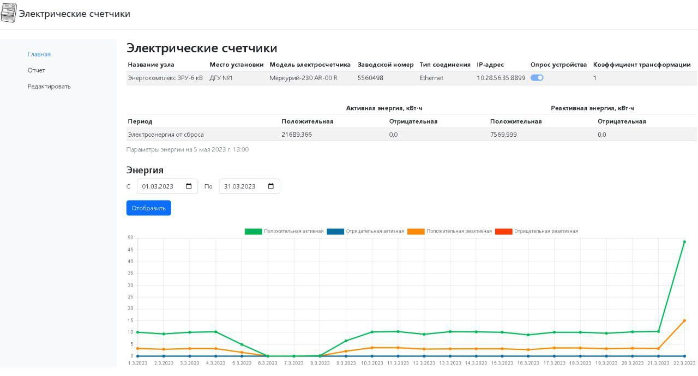

# ElectricsMeters3

Data collector from electricity meters Mercury 230 series.  
Implemented the display of infographics on electricity consumption and cyclic interval polling of electricity meters.  
Below are some screenshots of the web interface.  

